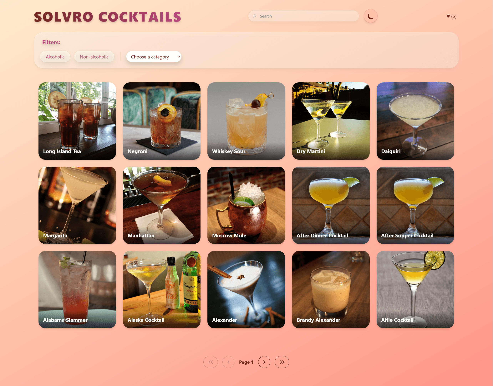
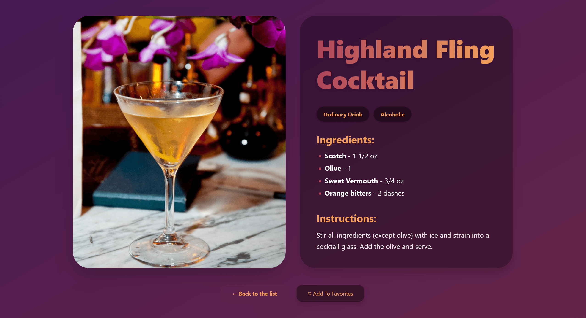

## Solvro Cocktails 🍸
A web application for browsing, searching, and managing cocktail recipes.




## Features
- **Search and Filter**: Find drinks by name, category, or type.
- **Detailed View**: See ingredients, measures, and instructions.
- **Favorites**: Pick your favorites and keep them in one place.
- **Responsive**: Browse drinks on any device.
- **Themes**: Switch between light and dark mode.



## Tech Stack
- **Framework**: Next.js
- **Styling**: Tailwind CSS
- **Data Fetching**: TanStack Query
- **API**: https://cocktails.solvro.pl/api/v1

## Getting Started

First, clone the repository:
```bash
git clone https://github.com/azvrc/solvro-cocktails.git
```

Install dependencies:
```bash
npm install
```

Run the development server:
```bash
npm run dev
# or
yarn dev
# or
pnpm dev
# or
bun dev
```

Open [http://localhost:3000](http://localhost:3000) with your browser to see the result.
